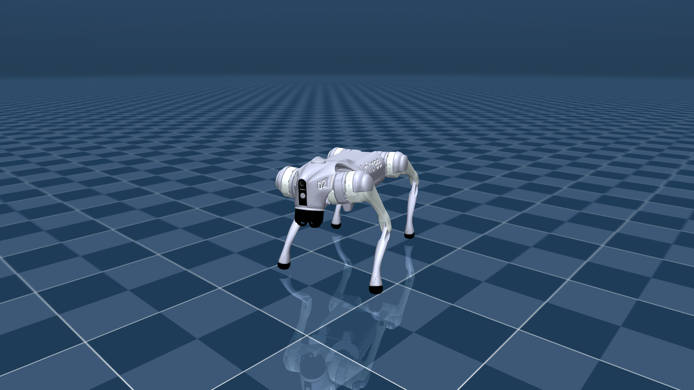

<div align="center">
  <h1>Unitree Go2 RL Gym</h1>
  <p><strong>面向 Unitree Go2 的强化学习训练、MuJoCo Sim2Sim 与安全部署工程。</strong></p>
</div>



> [!IMPORTANT]
> 本项目基于 Unitree 官方
> [unitree_rl_gym](https://github.com/unitreerobotics/unitree_rl_gym)
> 开发，但不是 Unitree 官方项目，也不代表 Unitree Robotics 的官方实现或背书。
> 本 README 只介绍本项目完成的 Go2 工作；仓库中保留的其他机器人上游代码不属于本项目成果。

## 项目概览

本项目打通了以下 Go2 部署链路：

```text
Isaac Gym 训练
  → Isaac Gym Play 与策略导出
  → Python MuJoCo Sim2Sim
  → Unitree SDK2 / DDS 官方 MuJoCo 闭环
  → 实体 Go2 分级验收（待现场完成）
```

当前正式策略采用：

- 45 维 Actor：机身角速度、投影重力、速度指令、关节位置、关节速度和上一帧动作；
- 60 维 Critic：仅训练时额外使用机身线速度和关节力矩等特权信息；
- 12 维动作：对应 Go2 的 12 个驱动关节；
- 50 Hz 策略频率：控制周期为 0.02 秒；
- PD 参数：Policy 阶段 `Kp=20`、`Kd=0.5`。

Actor 只依赖真机可获得的信息。Critic 不会进入导出的 TorchScript，也不会用于 MuJoCo 或真机推理。

## 已完成内容

- Go2 45/60 非对称 Actor-Critic 训练环境与官方关键奖励适配；
- 1500 轮正式训练、Isaac Gym Play 和 checkpoint/TorchScript 一致性验证；
- Actor 与 `deploy.yaml` 成套导出，固化观测、动作、PD 参数和关节映射；
- Unitree 官方 Go2 MJCF 资产接入及专用 Python MuJoCo 运行器；
- 平地六方向、长时运行、组合指令和外力扰动 Sim2Sim 验收；
- Go2 真机侧四态 FSM：`Passive → FixStand → Policy / Damping`；
- LowState、LowCmd、CRC、DDS、遥控器和策略/SDK 关节顺序转换；
- 通信、姿态、关节、动作变化、目标角和估算力矩安全检查；
- 官方 `unitree_mujoco + unitree_sdk2py + DDS` 前进与组合指令闭环；
- 17 项 Go2 自动测试。

当前尚未完成实体 Go2 的吊架和落地验收，因此不能宣称已经完成实体真机部署。

## 关键目录

```text
legged_gym/envs/go2/                 Go2 训练配置与45/60维观测
legged_gym/scripts/train.py          Isaac Gym训练入口
legged_gym/scripts/play.py           Play、Actor与部署契约导出
legged_gym/utils/deploy.py           deploy.yaml导出
deploy/common/go2_policy.py          MuJoCo与Real共用的观测/动作接口
deploy/deploy_mujoco/deploy_go2.py   Go2专用Python MuJoCo运行器
deploy/deploy_mujoco/configs/go2.yaml
deploy/deploy_real/deploy_real_go2.py
deploy/deploy_real/configs/go2.yaml
deploy/pre_train/go2/motion.pt       冻结的正式TorchScript Actor
resources/robots/go2/mjcf/           官方Go2 MJCF及场景资产
tests/test_go2*.py                   Go2回归测试
```

## 环境准备

基础依赖与 Isaac Gym 安装方式见 [中文安装说明](doc/setup_zh.md)。本项目当前使用两个环境：

- `LeggedGym`：Isaac Gym 训练与 Play；
- `unitree-rl`：MuJoCo、自动测试及 Unitree SDK2/DDS 部署。

进入项目目录：

```bash
cd /home/wkh/projects/unitree_rl_gym
```

## 1. Isaac Gym 训练

激活训练环境：

```bash
source /home/wkh/anaconda3/etc/profile.d/conda.sh
conda activate LeggedGym
```

正式训练前建议先运行小规模契约检查：

```bash
python legged_gym/scripts/train.py \
  --task=go2 --headless \
  --num_envs=64 --max_iterations=2 \
  --run_name=contract_check
```

网络打印应显示 Actor 输入 45 维、Critic 输入 60 维，且训练过程没有 NaN、Inf 或维度错误。

正式训练：

```bash
python legged_gym/scripts/train.py \
  --task=go2 --headless \
  --num_envs=4096 --max_iterations=1500 \
  --run_name=go2_45x60_official_rewards
```

checkpoint 默认保存到：

```text
logs/rough_go2_45x60_rewards/<时间>_<run名称>/model_<迭代数>.pt
```

## 2. Play 与导出

指定正式 run 和 checkpoint：

```bash
python legged_gym/scripts/play.py \
  --task=go2 --headless \
  --load_run=<实际run目录名> \
  --checkpoint=1500
```

Play 会成套导出：

```text
logs/rough_go2_45x60_rewards/exported/policies/policy_1.pt
logs/rough_go2_45x60_rewards/exported/params/deploy.yaml
```

`policy_1.pt` 与 `deploy.yaml` 必须配套使用，不能混用不同训练 run 的策略和参数。

## 3. Go2 MuJoCo Sim2Sim

激活部署环境：

```bash
source /home/wkh/anaconda3/etc/profile.d/conda.sh
conda activate unitree-rl
```

打开 MuJoCo 窗口并发送前进指令：

```bash
python deploy/deploy_mujoco/deploy_go2.py --command 0.5 0.0 0.0
```

指令顺序为 `前进速度 侧向速度 偏航角速度`。例如：

```bash
# 静止站立
python deploy/deploy_mujoco/deploy_go2.py --command 0.0 0.0 0.0

# 左移
python deploy/deploy_mujoco/deploy_go2.py --command 0.0 0.3 0.0

# 左转
python deploy/deploy_mujoco/deploy_go2.py --command 0.0 0.0 0.5

# 前进、左移并右转
python deploy/deploy_mujoco/deploy_go2.py --command 0.5 0.2 -0.3
```

无窗口快速验收：

```bash
python deploy/deploy_mujoco/deploy_go2.py \
  --headless --no-realtime --duration 10 \
  --command 0.5 0.0 0.0
```

外力扰动测试：

```bash
python deploy/deploy_mujoco/deploy_go2.py \
  --headless --no-realtime --duration 10 \
  --command 0.5 0.0 0.0 \
  --push-at 5 --push-duration 0.2 --push-force 50 0 0
```

运行结束会输出 JSON 指标，包括跌倒状态、有限值检查、机身高度、最大倾角、最大力矩、位移和速度。

## 4. 自动测试

```bash
conda activate unitree-rl
python -m unittest discover -s tests -p 'test_go2*.py'
```

当前基线为 17 项 Go2 测试全部通过，覆盖训练契约、45 维策略接口、MJCF、关节映射、FSM、控制器和安全降级。

## 5. Unitree SDK2 / DDS 部署

详细安全步骤见 [Go2 真机部署指南](deploy/deploy_real/README_GO2.zh.md)。实体机器人可能造成设备损坏或人身伤害，禁止跳过 DDS 仿真、只读连接或吊架验证。

只检查 Real 配置和冻结模型，不初始化 DDS：

```bash
python deploy/deploy_real/deploy_real_go2.py --check
```

官方 MuJoCo DDS 闭环使用本机回环网卡和非零 domain：

```bash
python deploy/deploy_real/deploy_real_go2.py lo \
  --domain-id 1 \
  --simulation-auto \
  --duration 12 \
  --command 0.3 0.0 0.0
```

`--simulation-auto` 被限制为 `lo + 非零 domain`，不能用于实体机器人。

实体 Go2 的第一步只能是只读连接：

```bash
python deploy/deploy_real/deploy_real_go2.py <有线网卡> --read-only
```

后续必须按以下顺序逐级验收：

```text
只读LowState
→ 阻尼与急停
→ 吊架FixStand
→ 策略只推理、不下发
→ 吊架限幅短时下发
→ 落地站立与微速运动
→ 组合指令、扰动和长时运行
```

任何阶段出现通信超时、姿态异常、关节撞限位、异常声响或安全降级，都应立即停止升级测试并检查 `logs/go2_real/*.jsonl`，不能通过放宽安全阈值掩盖问题。

## 已知限制

- 策略实现的是近似速度跟踪，不是精确速度伺服；侧移和转向仍存在幅值欠跟踪。
- Isaac Gym 使用 URDF，MuJoCo 使用 MJCF，两者在接触、惯量、碰撞体和求解器上存在差异。
- 当前稳定性结论来自 Isaac Gym、Python MuJoCo 和官方 DDS/MuJoCo；实体 Go2 现场结果仍待验证。
- 修改观测顺序、缩放、关节映射、动作缩放、PD 参数或控制周期后，必须重新执行对应训练与部署验收。

## 致谢与来源

本项目建立在以下开源项目之上：

- [unitree_rl_gym](https://github.com/unitreerobotics/unitree_rl_gym)：项目上游与 Isaac Gym 训练框架；
- [legged_gym](https://github.com/leggedrobotics/legged_gym)：腿式机器人训练环境；
- [rsl_rl](https://github.com/leggedrobotics/rsl_rl)：PPO 实现；
- [MuJoCo](https://github.com/google-deepmind/mujoco)：Sim2Sim 物理仿真；
- [unitree_mujoco](https://github.com/unitreerobotics/unitree_mujoco)：Go2 MJCF 与官方 DDS 仿真链路；
- [unitree_sdk2_python](https://github.com/unitreerobotics/unitree_sdk2_python)：Go2 DDS 通信接口。

上游保留代码及资产继续遵循各自的版权与许可证条款。

## 许可证

本仓库按 [BSD 3-Clause License](LICENSE) 授权。使用和分发时请同时遵守仓库内第三方组件与资产的许可证要求。
